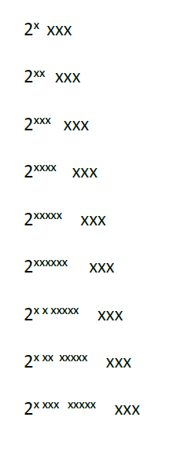

# syncfusion-issue-exponent

This solution demonstrates an issue with `Syncfusion.DocIORenderer.Net.Core` version `19.1.0.67`, where text containing exponents is not converted properly from Word to PDF (spacing is weird), as this image demonstrates:

This repository is provided to help Syncfusion support to reproduce and fix the issue.

> Syncfusion [issue](https://www.syncfusion.com/support/directtrac/incidents/331611)
